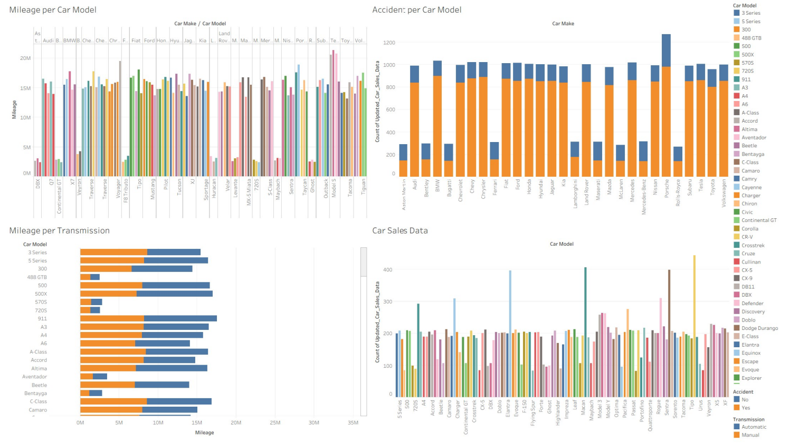

# Car Sales Analysis (Tableau)

A Tableau workbook exploring car sales data, examining mileage, accident rates, and transmission type across different car models.

## 📊 Overview
This workbook analyzes vehicle data to uncover patterns between car models, mileage, transmission type, and accident history.

## Key Worksheets
- **Car Sales Data** – overview of sales records
- **Mileage per Car Model** – average mileage by model
- **Mileage per Transmission** – mileage comparison by transmission type (manual vs. automatic)
- **Accident per Car Model** – accident counts across car models

